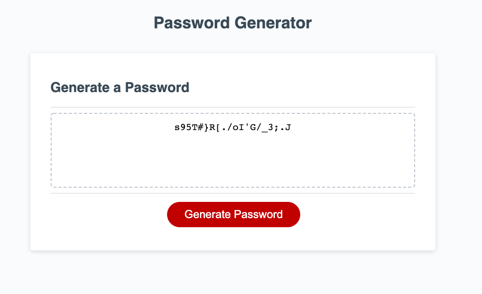

# Password Generator

## Description

The purpose of this project was to learn how to apply JavaScript fundamentals to a web application. This application generates a password suggestion based on user-selected criteria, which can be more secure than a user-selected password. While building this project I learned about the practical use of variables, operators, objects, functions, methods, if statements, and for loops. Going through the process of debugging my code was a great learning experience in itself.

## Usage

To access this application, visit the following URL: [https://rpecuch.github.io/password-generator/](https://rpecuch.github.io/password-generator/). To start the password generator, click the "Generate Password" button.

The user will first be prompted to select the length of the password.

The user will then be taken through a series of prompts to establish criteria for the password.

The generated password will then be displayed.

To run the password generator again, simply click the "Generate Password" button again.

## Credits

This project was built using the [starter code](https://github.com/coding-boot-camp/friendly-parakeet) from the friendly-parakeet repository created by GitHub user @coding-boot-camp.

## License

Please refer to the license in the repo.